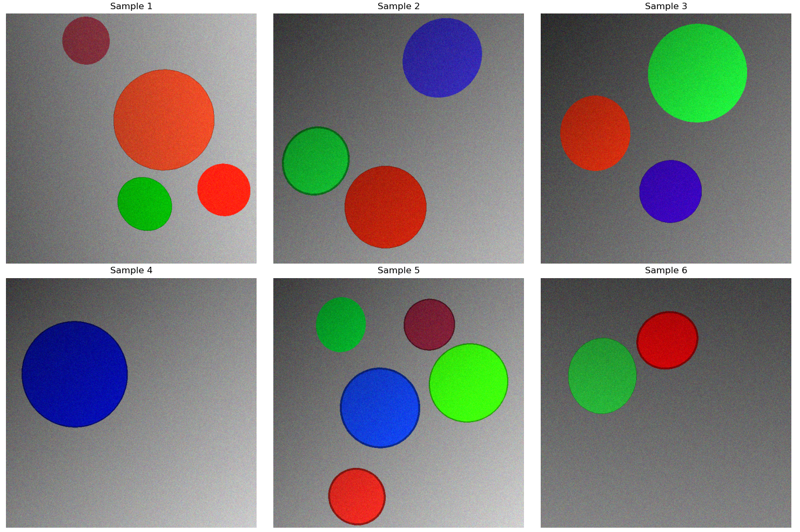
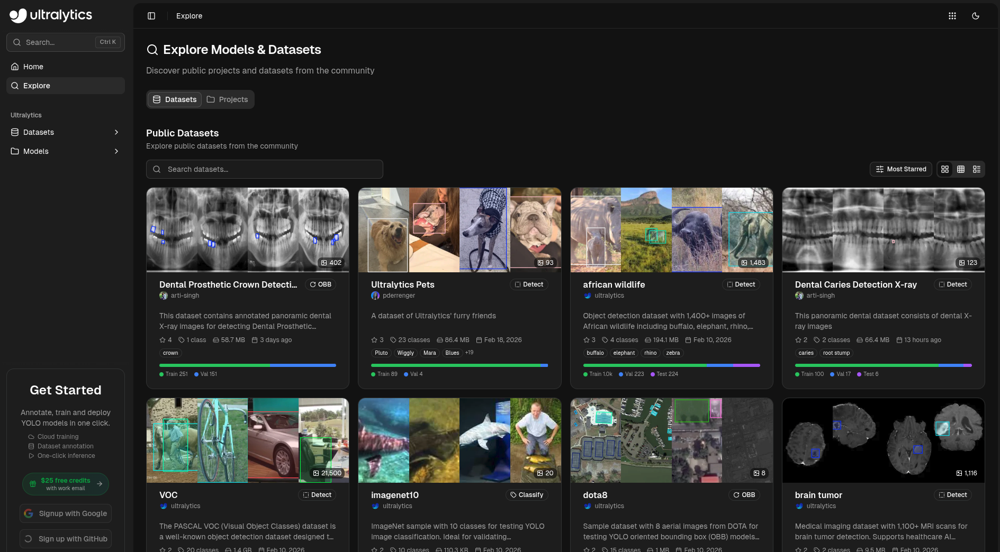

# 简述
为了方便夹爪进行定位夹取，我们需要进行视觉定位。
主要分为三种，颜色分别是红绿蓝，俯视呈现圆形，我们可以采用多种方法进行目标检测和定位。
- 霍夫圆变换
- 色块识别
- YOLO目标检测
# 方法详情
## 霍夫圆变换

霍夫圆变换（Hough Circle Transform）是一种基于数学投票机制的图像处理方法，用于在图像中检测圆形区域。其核心思想是将图像空间中的圆转换为参数空间中的点，通过在参数空间中寻找投票结果最集中的点来确定圆的位置和大小。

**1. 数学原理**

霍夫圆变换的基本原理可以用以下参数方程表示：

$$
(x - a)^2 + (y - b)^2 = r^2
$$

其中 $(a, b)$ 是圆心坐标，$r$ 是圆的半径。变换过程如下：

1. **图像预处理**：首先对图像进行灰度化，然后使用边缘检测（如 Canny）提取边缘点
2. **参数空间投票**：对于图像中的每个边缘点 $(x, y)$，遍历可能的圆心位置和半径，在参数空间中累加投票
3. **峰值检测**：投票数超过阈值的参数点对应图像中的圆形

**2. 代码实现（OpenMV/K230 示例）**

```python
# OpenMV 示例
import sensor, image, time

sensor.reset()
sensor.set_pixformat(sensor.RGB565)
sensor.set_framesize(sensor.QVGA)
sensor.skip_frames(time=2000)

while True:
    img = sensor.snapshot()

    # 霍夫圆变换参数：
    # - threshold: 投票阈值，越高要求越严格
    # - x_margin: 圆心x方向容差
    # - y_margin: 圆心y方向容差
    # - r_margin: 半径容差
    # - r_min/r_max: 最小/最大半径
    circles = img.find_circles(
        threshold=2000,
        x_margin=20,
        y_margin=20,
        r_margin=20,
        r_min=10,
        r_max=100
    )

    for circle in circles:
        # 绘制圆形
        img.draw_circle(circle.x(), circle.y(), circle.r(), color=(0, 255, 0))
        # 打印圆心坐标和半径
        print("Circle: x=%d, y=%d, r=%d" % (circle.x(), circle.y(), circle.r()))
```

**3. 参数说明**

| 参数 | 说明 | 推荐值 |
|------|------|--------|
| `threshold` | 累加器阈值，越高检测越严格 | 2000-3000 |
| `x_margin` / `y_margin` | 圆心坐标的容差范围 | 10-30 |
| `r_margin` | 半径的容差范围 | 10-30 |
| `r_min` / `r_max` | 检测半径的最小/最大值 | 根据实际场景调整 |

**4. 适用场景与优缺点**

- **优点**：无需训练，部署简单；对标准圆形检测效果好
- **缺点**：对光照敏感，抗噪能力较弱；难以检测变形或遮挡的圆
- **适用场景**：环境光照稳定、目标为标准圆形的简单场景

---

## 色块识别

色块识别（Color Blob Detection）是一种基于颜色空间分割的目标检测方法。其核心思想是通过颜色阈值将图像中符合特定颜色的像素提取出来，然后使用连通域分析获取色块的轮廓和中心坐标。

**1. 原理说明**

色块识别的工作流程如下：

1. **颜色空间转换**：将 RGB 图像转换到 HSV 颜色空间，HSV 更适合描述颜色的色相（Hue）、饱和度（Saturation）和明度（Value），受光照影响较小
2. **阈值分割**：根据目标颜色的 HSV 范围设定阈值，生成二值掩膜（mask）
3. **形态学处理**：对掩膜进行腐蚀、膨胀操作，去除噪声
4. **连通域分析**：使用 Blob 分析提取各独立色块的轮廓和中心

**2. 代码实现（OpenMV/K230 示例）**

```python
# OpenMV 示例 - 识别红色圆形
import sensor, image, time

sensor.reset()
sensor.set_pixformat(sensor.RGB565)
sensor.set_framesize(sensor.QVGA)
sensor.skip_frames(time=2000)

# 设置颜色阈值（针对红色）
# 格式：(L Min, L Max, A Min, A Max, B Min, B Max)
# LAB 颜色空间：L=亮度，A=红绿通道，B=蓝黄通道
red_threshold = (30, 100, 15, 127, 15, 127)

while True:
    img = sensor.snapshot()

    # 寻找符合阈值的色块
    blobs = img.find_blobs(
        [red_threshold],
        pixels_threshold=100,  # 最小像素数
        area_threshold=100,    # 最小面积
        merge=True,            # 是否合并相邻色块
        margin=10              # 边界Margin
    )

    for blob in blobs:
        # 绘制色块矩形
        img.draw_rectangle(blob.rect(), color=(0, 255, 0))
        # 绘制中心点
        img.draw_cross(blob.cx(), blob.cy(), color=(0, 255, 0))
        # 打印色块信息
        print("Red Blob: x=%d, y=%d, w=%d, h=%d" %
              (blob.cx(), blob.cy(), blob.w(), blob.h()))
```

**3. 阈值标定工具**

OpenMV 和 K230 都提供了 **阈值编辑器** 工具，可以直观地调整颜色阈值：

```python
# K230 - 使用阈值编辑器
# 在 CanMV IDE 中：Tools -> Machine Vision -> Threshold Editor
# 实时拖动滑块调整 HSV 阈值
```

```python
# 常用颜色 HSV 阈值参考（可根据实际光照调整）
COLOR_THRESHOLDS = {
    'Red': {
        'low': (0, 100, 80),
        'high': (10, 255, 255)
    },
    'Green': {
        'low': (35, 80, 80),
        'high': (85, 255, 255)
    },
    'Blue': {
        'low': (100, 80, 80),
        'high': (130, 255, 255)
    }
}
```

**4. 参数说明**

| 参数 | 说明 | 推荐值 |
|------|------|--------|
| `pixels_threshold` | 色块最小像素数 | 100-500 |
| `area_threshold` | 色块最小面积 | 100-500 |
| `merge` | 是否合并相邻色块 | True |
| `margin` | 边界合并容差 | 5-20 |

**5. 适用场景与优缺点**

- **优点**：无需训练，实时性好；对简单场景（颜色鲜明、环境稳定）效果极佳
- **缺点**：对光照变化敏感；无法区分颜色相同但形状不同的物体
- **适用场景**：光照稳定、目标颜色鲜明的简单分拣任务

---

## YOLO目标检测
YOLO（You Only Look Once）是一种基于卷积神经网络的目标检测算法。有多种基本模型：目标检测、关键点检测等等。我们现在使用基本都目标检测模型。

官方网址：https://www.ultralytics.com/

K230 部署参考文献：https://www.kendryte.com/k230_canmv/zh/main/zh/example/ai/YOLO%E5%A4%A7%E4%BD%9C%E6%88%98.html#yolov5
为了方便在边缘设备上部署，我们使用的是 yolov8 来进行部署，如果有支持 cuda 等高端设施的设备可以选择更新的模型。

说明：下文所 K230 部署的流程。
### 准备数据集
我们有多种方法构建数据集
- 手动拍摄照片
- 计算机模拟渲染
手动拍摄就平时怎么拍照就怎么操作就可以了，然后需要手动进行标注，工作量大，在当前场景下，我们选择计算机模拟的方法来生产图片。

目标：检测红绿蓝圆形

实现路径：
- 使用 matplotlib 绘制圆形

为了增强模型的泛化性，我们加入噪点、缩放、形变、条纹遮挡
演示单张图片的脚本：[创建数据集.py](3.操作.md/创建数据集.py)

#### 代码详细解读

下面对生成数据集的脚本进行详细解读，帮助理解其工作原理。

##### 1. 配置参数区

```python
CONFIG = {
    "img_size": 640,              # 图像尺寸 640x640
    "circle_count": (1, 5),       # 每张图片生成 1-5 个圆形
    "radius_range": (60, 140),    # 圆形半径范围 60-140 像素
    "color_variance": 40,          # 颜色波动范围，越大颜色越多样
    "deformation": {              # 形状微调
        "min_ratio": 0.90,         # 最小长宽比 0.9（轻微椭圆）
        "max_ratio": 1.0,          # 最大长宽比 1.0（正圆）
    },
    "lighting_strength": 0.6,     # 光照强度系数
    "noise_level": 15,            # 颗粒噪点强度
    "outline": {                  # 描边设置
        "prob": 0.7,              # 70%概率添加描边
        "thickness": (1, 3),      # 描边厚度 1-3 像素
        "color_darkness": 0.6     # 描边颜色为本体的 0.6 倍暗度
    }
}
```

**参数设计意图：**
- `img_size: 640` 与 YOLO 默认输入尺寸一致，方便后续模型训练
- `circle_count: (1, 5)` 模拟真实场景中可能出现的不定数量目标
- `radius_range` 覆盖从较小到较大的圆形，增强模型对尺寸变化的适应性

##### 2. 颜色生成函数 get_varied_color

```python
def get_varied_color(class_id):
    base_val = random.randint(180, 255)  # 主通道高亮 (180-255)
    noise_val = random.randint(0, 60)     # 其他通道低值 (0-60)

    if class_id == 0:   # Red -> (B低, G低, R高)
        color = [noise_val, noise_val, base_val]
    elif class_id == 1: # Green -> (B低, G高, R低)
        color = [noise_val, base_val, noise_val]
    else:               # Blue -> (B高, G低, R低)
        color = [base_val, noise_val, noise_val]

    # 加入随机波动
    for i in range(3):
        offset = random.randint(-CONFIG["color_variance"], CONFIG["color_variance"])
        color[i] = np.clip(color[i] + offset, 0, 255)

    return tuple(map(int, color))
```

**工作原理：**
- 利用 OpenCV 的 BGR 颜色格式，通过让一个通道高、其他通道低来生成纯色
- `class_id` 对应 YOLO 的类别：0=红、1=绿、2=蓝
- 加入 `color_variance` 波动后，同一类别的圆颜色会有细微差异，避免模型死记硬背特定颜色

##### 3. 环境特效函数 apply_fusion_effects

```python
def apply_fusion_effects(image):
    img_float = image.astype(np.float32)

    # 1. 光照效果：随机方向梯度光
    direction = random.choice(['h', 'v', 'd'])  # 水平、垂直、对角线
    if direction == 'h':
        mask[:] = np.linspace(0.6, 1.2, w)  # 左侧暗、右侧亮
    elif direction == 'v':
        mask = np.linspace(0.6, 1.2, h)[:, None] * np.ones((1, w))
    else:
        # 对角线方向的光照
        X, Y = np.meshgrid(np.arange(w), np.arange(h))
        mask = (X + Y) / (w + h) + 0.4

    img_float = img_float * mask  # 叠加光照

    # 2. 颗粒噪点：模拟真实传感器噪声
    noise = np.random.normal(0, CONFIG["noise_level"], image.shape)
    img_float = img_float + noise

    return np.clip(img_float, 0, 255).astype(np.uint8)
```

**作用说明：**
- **光照效果**：模拟真实环境中的光照不均问题，训练出的模型能在不同光照条件下工作
- **颗粒噪点**：模拟低质量摄像头或弱光环境下的图像噪点，提升模型鲁棒性

##### 4. 防重叠检测 check_overlap

```python
def check_overlap(new_circle, objects, padding=10):
    nx, ny, na, nb = new_circle
    nr = max(na, nb)  # 新圆的半径

    for ox, oy, oa, ob, _, _ in objects:
        or_rad = max(oa, ob)
        dist = np.sqrt((nx-ox)**2 + (ny-oy)**2)
        if dist < (nr + or_rad + padding):
            return True  # 发生重叠
    return False
```

**功能说明：**
- 每次生成新圆时，检查是否与已存在的圆重叠
- `padding=10` 增加一点安全间距，避免圆与圆过于靠近
- 确保数据集标注清晰，不会出现难以区分的粘连情况

##### 5. 主生成函数 generate_clean_sample

```python
def generate_clean_sample():
    # 1. 创建背景：灰度值随机 60-180
    bg_color = random.randint(60, 180)
    img = np.full((640, 640, 3), bg_color, dtype=np.uint8)

    # 2. 生成 1-5 个圆形
    objects = []
    count = random.randint(*CONFIG["circle_count"])

    for _ in range(count):
        # 随机尺寸、形变、位置
        major = random.randint(60, 140)
        ratio = random.uniform(0.90, 1.0)  # 轻微椭圆
        minor = int(major * ratio)
        x = random.randint(margin, 640-margin)
        y = random.randint(margin, 640-margin)

        # 绘制实心圆
        cv2.ellipse(img, (x, y), (major, minor), angle, 0, 360, color, -1)

        # 随机描边（70%概率）
        if random.random() < 0.7:
            outline_color = [int(c * 0.6) for c in color]
            cv2.ellipse(img, ..., outline_color, thickness)

    # 3. 叠加光照和噪点
    img = apply_fusion_effects(img)

    return img
```

**完整流程：**
1. **创建背景**：随机灰度背景，避免纯黑或纯白
2. **绘制圆形**：随机数量、随机位置、随机颜色、随机轻微形变、随机描边
3. **应用特效**：最后叠加光照和噪点，使整体效果更真实

这种生成方式能够在短时间内产出大量多样化的训练数据，有效提升模型的泛化能力。

---

#### 批量生成完整数据集

上述 `创建数据集.py` 演示了单张图片的生成逻辑，而 `批量生成.py` 则在此基础上增加了完整数据集的构建功能，包括目录结构、YOLO 格式标签、训练/验证集划分等。

##### 1. 数据集配置参数

```python
CONFIG = {
    # 📁 路径与数量
    "save_root": "yolo_dataset",   # 数据集保存根目录
    "num_train": 1000,             # 训练集数量 1000 张
    "num_val": 200,               # 验证集数量 200 张
    "img_size": 640,              # 图片尺寸 640x640

    # 🎯 目标设置
    "circle_count": (1, 4),       # 每张图 1-4 个圆
    "radius_range": (50, 130),    # 半径范围 50-130 像素
    "deformation": (0.9, 1.0),    # 轻微椭圆变形

    # ⚡ 干扰设置
    "noise": {
        "sensor_grain_level": 25,     # 传感器颗粒噪点强度
        "lines_count": (5, 15),        # 随机直线数量
        "rects_count": (3, 8),         # 随机矩形数量
        "scratches_count": (3, 8),     # 锯齿/划痕数量
        "interference_alpha": 0.6      # 干扰层透明度
    },

    # 💡 光照设置
    "lighting": {
        "enabled": True,
        "strength": 0.5
    }
}
```

**配置说明：**
- `save_root` 指定数据集保存位置，运行后会在当前目录生成 `yolo_dataset` 文件夹
- `num_train` / `num_val` 划分训练集和验证集，通常比例为 80:20
- `noise` 模块新增了几何干扰参数，用于模拟真实场景中的干扰物

##### 2. 目录结构创建 setup_directories

```python
def setup_directories():
    """初始化目录结构"""
    root = CONFIG["save_root"]
    if os.path.exists(root):
        shutil.rmtree(root)  # 清空旧数据，避免混淆

    # 创建 YOLO 标准目录结构
    for t in ['train', 'val']:
        os.makedirs(os.path.join(root, 'images', t), exist_ok=True)
        os.makedirs(os.path.join(root, 'labels', t), exist_ok=True)
```

**YOLO 数据集标准结构：**
```
yolo_dataset/
├── images/
│   ├── train/      # 训练图片
│   └── val/       # 验证图片
├── labels/
│   ├── train/     # 训练标签 (txt)
│   └── val/       # 验证标签 (txt)
└── dataset.yaml   # 数据集配置文件
```

##### 3. 几何干扰 add_geometric_noise

```python
def add_geometric_noise(image):
    """添加几何干扰 (线、矩形、锯齿)"""
    overlay = image.copy()

    # 1. 随机直线 (模拟电线/杆子)
    for _ in range(random.randint(*CONFIG["noise"]["lines_count"])):
        pt1 = (random.randint(0, w), random.randint(0, h))
        pt2 = (random.randint(0, w), random.randint(0, h))
        cv2.line(overlay, pt1, pt2, color, thickness)

    # 2. 空心矩形 (模拟框框/背景杂物)
    for _ in range(random.randint(*CONFIG["noise"]["rects_count"])):
        cv2.rectangle(overlay, pt1, pt2, color, thickness)

    # 3. 锯齿/划痕 (模拟表面损伤)
    for _ in range(random.randint(*CONFIG["noise"]["scratches_count"])):
        # 多段短线组成不规则划痕
        for _ in range(random.randint(5, 15)):
            cv2.line(overlay, (curr_x, curr_y), (next_x, next_y), (200,200,200), 1)

    # 融合干扰层 (保持半透明，不完全遮挡物体)
    alpha = CONFIG["noise"]["interference_alpha"]
    return cv2.addWeighted(overlay, alpha, image, 1 - alpha, 0)
```

**干扰设计意图：**
- **直线**：模拟环境中垂直/水平的线条干扰（如电线、架子）
- **矩形**：模拟框状物体或背景中的规则物体
- **锯齿/划痕**：模拟物体表面不规则损伤
- `interference_alpha=0.6` 保证干扰层半透明，不会完全遮挡目标

##### 4. YOLO 标签生成 get_rotated_bbox

```python
def get_rotated_bbox(cx, cy, a, b, angle_deg):
    """
    计算旋转椭圆的轴对齐外接矩形
    用于 YOLO 标签生成 (cx, cy, w, h)
    """
    rad = math.radians(angle_deg)
    sin_a = math.sin(rad)
    cos_a = math.cos(rad)

    # 椭圆参数方程推导外接矩形半宽/半高
    half_w = math.sqrt((a * cos_a)**2 + (b * sin_a)**2)
    half_h = math.sqrt((a * sin_a)**2 + (b * cos_a)**2)

    return int(half_w * 2), int(half_h * 2)
```

**YOLO 标签格式：**
YOLO 标签为纯文本文件，每行一个目标：
```
<class_id> <x_center> <y_center> <width> <height>
```
- 所有值均为归一化的小数（0-1）
- `<x_center>`、`<y_center>`：目标中心点坐标
- `<width>`、`<height>`：目标宽高

**示例：**
```
0 0.5 0.5 0.3 0.4   # 类别0（红），中心(50%,50%)，宽30%高40%
1 0.2 0.3 0.15 0.2  # 类别1（绿），中心(20%,30%)，宽15%高20%
```

##### 5. 主生成函数 generate_image_and_label

```python
def generate_image_and_label(index, subset):
    # 1. 创建背景
    img = np.full((640, 640, 3), bg_gray, dtype=np.uint8)

    # 2. 生成圆形目标
    for _ in range(random.randint(*CONFIG["circle_count"])):
        # ... 绘制圆形 ...

        # 计算并保存 YOLO 标签
        bbox_w, bbox_h = get_rotated_bbox(x, y, major, minor, angle)
        norm_x = x / CONFIG["img_size"]
        norm_y = y / CONFIG["img_size"]
        norm_w = bbox_w / CONFIG["img_size"]
        norm_h = bbox_h / CONFIG["img_size"]

        labels.append(f"{class_id} {norm_x:.6f} {norm_y:.6f} {norm_w:.6f} {norm_h:.6f}")

    # 3. 施加几何干扰
    img = add_geometric_noise(img)

    # 4. 施加环境特效
    img = apply_final_effects(img)

    # 5. 保存图片和标签
    cv2.imwrite(img_path, img)
    with open(txt_path, 'w') as f:
        f.write("\n".join(labels))
```

**完整流程：**
1. 创建随机灰度背景
2. 生成 1-4 个圆形目标，计算 YOLO 格式标签
3. 叠加几何干扰（直线、矩形、划痕）
4. 叠加光照和传感器噪点
5. 分别保存 `.jpg` 图片和 `.txt` 标签文件

##### 6. 数据集配置文件 create_yaml

```python
def create_yaml():
    """生成 dataset.yaml"""
    content = f"""
path: ../{CONFIG["save_root"]}
train: images/train
val: images/val

nc: 3
names: ['Red', 'Green', 'Blue']
    """
    with open(os.path.join(CONFIG["save_root"], "dataset.yaml"), 'w') as f:
        f.write(content.strip())
```

**dataset.yaml 说明：**
- `path`：数据集根目录的相对路径
- `train`/`val`：训练集和验证集的图片路径
- `nc`：类别数量（3 个：红、绿、蓝）
- `names`：类别名称列表

该配置文件是 YOLO 训练时的入口文件，指定数据路径和类别信息。

#### 代码生成效果展示

图像预览：

我们可以循环生成大量图片，并根据随机出来的相关内容作为数据集的 label 就可以进行后续的训练了
### 开始训练
可以进行本地训练也可以使用官方的云端训练，如果本地电脑配置较高，可以进行本地训练。
#### 本地训练

本地训练需要配置 Python 环境并使用 ultralytics 库进行模型训练。以下是完整的本地训练流程。

##### 1. 环境准备

**（1）安装 Anaconda（推荐）**

Anaconda 是 Python 环境管理工具，可以方便地创建和管理独立的 Python 环境。去网上搜教程看看。

```bash
# 1. 下载安装包：https://www.anaconda.com/download
# 2. 安装完成后，打开 Anaconda Prompt

# 3. 创建新环境
conda create -n yolo python=3.10

# 4. 激活环境
conda activate yolo
```

**（2）安装依赖库**

```bash
# 安装 PyTorch（根据 CUDA 版本选择）
# CUDA 11.8
pip install torch==2.0.1 torchvision==0.15.2 --index-url https://download.pytorch.org/whl/cu118

# CUDA 12.1
# pip install torch==2.0.1 torchvision==0.15.2 --index-url https://download.pytorch.org/whl/cu121

# 安装 ultralytics（YOLO 官方库）
pip install ultralytics

# 安装其他常用依赖
pip install opencv-python numpy pillow matplotlib
```

**（3）验证安装**

```python
import torch
print(f"PyTorch version: {torch.__version__}")
print(f"CUDA available: {torch.cuda.is_available()}")

from ultralytics import YOLO
print("Ultralytics installed successfully!")
```

##### 2. 准备数据集

确保数据集目录结构符合 YOLO 格式：

```
yolo_dataset/
├── images/
│   ├── train/          # 训练图片
│   └── val/           # 验证图片
├── labels/
│   ├── train/         # 训练标签（txt）
│   └── val/           # 验证标签（txt）
└── dataset.yaml       # 数据集配置文件
```

**dataset.yaml 文件内容：**

```yaml
# dataset.yaml
path: ./yolo_dataset      # 数据集根目录
train: images/train      # 训练集图片路径
val: images/val          # 验证集图片路径

nc: 3                    # 类别数量
names: ['Red', 'Green', 'Blue']  # 类别名称
```

##### 3. 训练代码

创建训练脚本 `train.py`：

```python
from ultralytics import YOLO
import os

# 设置 CUDA 可见设备（使用 GPU 0）
os.environ['CUDA_VISIBLE_DEVICES'] = '0'

# 1. 加载预训练模型（从 yolov8n.pt 开始，自动下载）
model = YOLO('yolov8n.pt')  # n: nano, s: small, m: medium

# 2. 开始训练
results = model.train(
    data='dataset.yaml',          # 数据集配置文件
    epochs=30,                    # 训练轮数
    imgsz=320,                    # 输入图像尺寸（320/640）
    batch=16,                     # 批次大小（根据显存调整）
    patience=5,                   # 早停耐心值
    save=True,                    # 保存训练结果
    project='runs/detect',        # 保存目录
    name='exp',                   # 实验名称
    exist_ok=True,                # 是否覆盖已有结果
    pretrained=True,              # 使用预训练权重
    optimizer='SGD',              # 优化器（SGD/Adam/AdamW）
    lr0=0.01,                     # 初始学习率
    lrf=0.01,                     # 最终学习率 (lr0 * lrf)
    momentum=0.937,               # 动量
    weight_decay=0.0005,         # 权重衰减
    warmup_epochs=3,              # 预热轮数
    warmup_momentum=0.8,          # 预热动量
    box=7.5,                     # 边框损失权重
    cls=0.5,                      # 分类损失权重
    dfl=1.5,                      # DFL 损失权重
    workers=8,                    # 数据加载线程数
    device='0',                   # 使用 GPU 0
    verbose=True,                # 显示详细信息
)
```

**（4）运行训练**

```bash
# 在终端中运行
python train.py
```

##### 4. 参数说明

| 参数 | 说明 | 推荐值 |
|------|------|--------|
| `model` | 预训练模型 | `yolov8n.pt`（nano 最小最快）|
| `epochs` | 训练轮数 | 30-100 |
| `imgsz` | 输入尺寸 | 320（快）或 640（准）|
| `batch` | 批次大小 | 8-32（根据显存）|
| `patience` | 早停耐心 | 5-10 |
| `lr0` | 初始学习率 | 0.01 |
| `optimizer` | 优化器 | SGD/Adam/AdamW |

**模型规格选择：**

| 模型 | 参数量 | 推理速度 | 精度 |
|------|--------|----------|------|
| yolov8n | 3.2M | 最快 | 较低 |
| yolov8s | 11.2M | 快 | 中等 |
| yolov8m | 25.9M | 中等 | 较高 |
| yolov8l | 43.7M | 慢 | 高 |

##### 5. 训练结果

训练完成后，结果保存在 `runs/detect/exp/` 目录下：

```
runs/detect/exp/
├── weights/
│   ├── best.pt         # 最佳模型
│   └── last.pt         # 最后一轮模型
├── results.png         # 训练曲线
├── confusion_matrix.png
└── ...
```

**训练曲线解读：**

- **box_loss**：边界框回归损失，越低越好
- **cls_loss**：分类损失，越低越好
- **precision**：精确率，越高越好
- **recall**：召回率，越高越好
- **mAP50**：IoU=0.5 时的平均精度
- **mAP50-95**：IoU=0.5~0.95 的平均精度

##### 6. 模型验证

训练完成后，可以使用验证集评估模型性能：

```python
from ultralytics import YOLO

# 加载训练好的模型
model = YOLO('runs/detect/exp/weights/best.pt')

# 在验证集上评估
results = model.val(
    data='dataset.yaml',
    imgsz=320,
    batch=16,
    split='val'
)

# 打印结果
print(f"mAP50: {results.box.map50:.4f}")
print(f"mAP50-95: {results.box.map:.4f}")
print(f"Precision: {results.box.mp:.4f}")
print(f"Recall: {results.box.mr:.4f}")
```

##### 7. 本地推理测试

使用训练好的模型在本地进行推理测试：

```python
from ulteralxics import YOLO
import cv2

# 加载模型
model = YOLO('runs/detect/exp/weights/best.pt')

# 读取图片
img = cv2.imread('test.jpg')

# 推理
results = model(img, imgsz=320, conf=0.5)

# 解析结果
for r in results:
    boxes = r.boxes
    for box in boxes:
        # 获取坐标
        x1, y1, x2, y2 = box.xyxy[0].cpu().numpy()
        # 获取类别和置信度
        cls = int(box.cls[0])
        conf = float(box.conf[0])
        label = model.names[cls]

        # 绘制框
        cv2.rectangle(img, (int(x1), int(y1)), (int(x2), int(y2)), (0, 255, 0), 2)
        cv2.putText(img, f"{label} {conf:.2f}", (int(x1), int(y1)-10),
                    cv2.FONT_HERSHEY_SIMPLEX, 0.5, (0, 255, 0), 2)

# 保存结果
cv2.imwrite('result.jpg', img)
```

---

#### 云端训练
登陆官方训练平台：https://platform.ultralytics.com
开局免费赠送一定额度，可以白嫖，足够好几次训练

1. 点击左侧栏目导入我们上一波生成的数据集，然后开始训练。
2. 点击右上角 New Model
3. 选择 Base Model
   1. 选择兼容较好的模型（yolov5、yolov8）
   2. 一般选择最小的 n 就可以了（本次选择yolov8-n）
   3. 数据集选择刚才导入的
   4. epoches 大约 30 就可以，patience 5 就可以了，可以提前结束训练来减少费用
   5. 使用的显卡可以看价格来选择
   6. Start 
4. 训练完成之后，下载模型到本地，此时模型应该是 .pt 格式
5. 转化为 onnx 格式
   1. 嘉楠官方推荐使用的转换模型脚本我自己使用（windows 环境）的时候有问题，无法正常转化，我提供我修复后的脚本：https://github.com/Tuzfucius/CanMV_yolo 
   2. 请参考README.md 进行后续配置
```
官方转化配置：
# windows平台：请自行安装dotnet-7并添加环境变量,支持使用pip在线安装nncase，但是nncase-kpu库需要离线安装，在https://github.com/kendryte/nncase/releases下载nncase_kpu-2.*-py2.py3-none-win_amd64.whl
# 进入对应的python环境，在nncase_kpu-2.*-py2.py3-none-win_amd64.whl下载目录下使用pip安装
pip install nncase_kpu-2.*-py2.py3-none-win_amd64.whl
```
   3. 运行脚本 创建数据集/导出onnx.py 导出模型
   4. 转换为 Kmodel (PC 端) 
   5. 将 Kmodel 模型放入 K230  

### 推理测试

模型训练完成后，需要将模型部署到 K230 开发板上进行推理测试。以下是完整的部署流程和代码解读。

---

#### 1. 模型部署准备

在运行推理脚本前，需要完成以下准备工作：

1. **模型文件放置**：将转换好的 `.kmodel` 文件（文件名需与脚本中定义的一致）放入 K230 的 `/data/` 目录下。本项目使用的模型文件为 `RGB_circle_det.kmodel`

2. **确保依赖库完整**：K230 镜像中需包含 `libs/` 目录下的 `PipeLine.py`、`YOLO.py`、`Utils.py` 等文件，这些是 K230 SDK 提供的视觉处理基础库

3. **连接显示设备**：根据 `display_mode` 参数配置相应的显示输出（HDMI/LCD）

---

#### 2. 代码详细解读

下面是 K230 上运行的推理脚本 `main.py` 的完整代码与逐段解读：

```python
from libs.PipeLine import PipeLine
from libs.YOLO import YOLOv8
from libs.Utils import *
import os,sys,gc
import ulab.numpy as np
import image
import time
```

**导入模块说明：**
- `PipeLine`：K230 视频流处理管道，负责摄像头取帧、图像预处理、显示输出
- `YOLO`：嘉楠官方提供的 YOLO 推理封装类，支持 Kmodel 格式模型
- `Utils`：工具函数集合
- `ulab.numpy`：K230 上的轻量级 numpy 替代库
- `image`：K230 的图像处理库
- `gc`：垃圾回收，用于内存管理

---

##### 2.1 配置参数区

```python
if __name__=="__main__":
    # 模型路径（使用 detect/to_kmodel.py 转换后的检测模型）
    kmodel_path="/data/RGB_circle_det.kmodel"
    labels = ['Red', 'Green', 'Blue']
    model_input_size=[320,320]

    # 添加显示模式，默认hdmi，可选hdmi/lcd/lt9611/st7701/hx8399,其中hdmi默认置为lt9611，分辨率1920*1080；lcd默认置为st7701，分辨率800*480
    display_mode="lcd"
    rgb888p_size=[640,360]
    confidence_threshold = 0.5
    nms_threshold=0.45
```

**参数说明：**

| 参数 | 说明 | 推荐值 |
|------|------|--------|
| `kmodel_path` | Kmodel 模型文件的绝对路径 | `/data/RGB_circle_det.kmodel` |
| `labels` | 类别名称列表，与训练时一致 | `['Red', 'Green', 'Blue']` |
| `model_input_size` | 模型输入尺寸，需与训练尺寸匹配 | `[320,320]` 或 `[640,640]` |
| `display_mode` | 显示输出模式 | `lcd`（K230 CanMV 板载屏幕）|
| `rgb888p_size` | 摄像头采集的图像分辨率 | `[640,360]` |
| `confidence_threshold` | 置信度阈值，低于此值的检测框被过滤 | `0.5` |
| `nms_threshold` | NMS 非极大值抑制阈值，用于去除重复框 | `0.45` |

> **提示**：模型输入尺寸的选择需要权衡精度与速度。320x320 推理速度更快，但精度略低；640x640 精度更高但耗时更长。

---

##### 2.2 初始化 PipeLine

```python
    # 初始化PipeLine
    pl=PipeLine(rgb888p_size=rgb888p_size,display_mode=display_mode)
    pl.create()
    display_size=pl.get_display_size()
```

**作用说明：**
- `PipeLine` 是 K230 SDK 的核心类，负责视频流的完整处理流程
- `rgb888p_size` 定义了摄像头采集的分辨率
- `display_mode` 指定输出显示设备
- `pl.create()` 初始化视频管道，建立摄像头与显示的连接
- `get_display_size()` 获取实际显示分辨率，供后续绘制使用

---

##### 2.3 初始化 YOLOv8 实例

```python
    # 初始化YOLOv8实例
    yolo=YOLOv8(task_type="detect",mode="video",kmodel_path=kmodel_path,labels=labels,rgb888p_size=rgb888p_size,model_input_size=model_input_size,display_size=display_size,conf_thresh=confidence_threshold,nms_thresh=nms_threshold,max_boxes_num=50,debug_mode=0)
    yolo.config_preprocess()
```

**参数详解：**

| 参数 | 说明 |
|------|------|
| `task_type` | 任务类型，`detect` 表示目标检测 |
| `mode` | 运行模式，`video` 表示视频流推理 |
| `kmodel_path` | 模型文件路径 |
| `labels` | 类别标签列表 |
| `rgb888p_size` | 源图像分辨率 |
| `model_input_size` | 模型输入尺寸 |
| `display_size` | 显示画面尺寸 |
| `conf_thresh` | 置信度阈值 |
| `nms_thresh` | NMS 阈值 |
| `max_boxes_num` | 单帧最大检测框数量 |
| `debug_mode` | 调试模式，0 为关闭 |

`config_preprocess()` 会根据参数自动配置图像预处理流程，包括尺寸缩放、归一化等。

---

##### 2.4 FPS 计算变量初始化

```python
    # FPS 计算变量
    fps = 0.0
    frame_count = 0
    fps_update_interval = 10  # 每10帧更新一次FPS显示
```

**作用说明：**
- `fps`：当前帧率的指数移动平均值
- `frame_count`：已处理的帧数计数器
- `fps_update_interval`：FPS 更新间隔（每处理 10 帧更新一次显示）

---

##### 2.5 主推理循环

```python
    try:
        while True:
            t_start = time.ticks_ms()

            with ScopedTiming("total",1):
                # 逐帧推理
                img=pl.get_frame()
                res=yolo.run(img)
                yolo.draw_result(res,pl.osd_img)

                # 计算并显示FPS
                t_end = time.ticks_ms()
                frame_time = time.ticks_diff(t_end, t_start)
                if frame_time > 0:
                    current_fps = 1000.0 / frame_time
                    # 平滑FPS（指数移动平均）
                    fps = fps * 0.7 + current_fps * 0.3 if fps > 0 else current_fps

                # 在左上角绘制FPS
                fps_text = "FPS: {:.1f}".format(fps)
                pl.osd_img.draw_string_advanced(8, 8, 32, fps_text, color=(255, 255, 0, 255))

                pl.show_image()
                gc.collect()
    except Exception as e:
        print("Error: ", e)
    finally:
        yolo.deinit()
        pl.destroy()
```

**主循环流程：**

1. **获取帧**：`pl.get_frame()` 从摄像头获取当前帧图像
2. **模型推理**：`yolo.run(img)` 输入图像到模型，返回检测结果
3. **绘制结果**：`yolo.draw_result(res, pl.osd_img)` 将检测框绘制到 OSD 层
4. **FPS 计算**：
   - 计算单帧处理耗时 `frame_time`
   - 使用指数移动平均（EMA）平滑 FPS 值，避免数值剧烈波动
5. **绘制 FPS**：在画面左上角显示实时帧率
6. **显示输出**：`pl.show_image()` 将 OSD 层内容输出到显示屏
7. **内存回收**：`gc.collect()` 手动触发垃圾回收，防止内存泄漏

**异常处理：**
- `try-except` 捕获运行中的错误并打印
- `finally` 确保资源释放：调用 `yolo.deinit()` 和 `pl.destroy()` 释放模型和管道资源

---

#### 3. 运行步骤

按照以下步骤在 K230 上运行推理脚本：

1. **上传模型文件**
   - 使用 SD 卡或网络传输将 `RGB_circle_det.kmodel` 放入 K230 的 `/data/` 目录

2. **上传推理脚本**
   - 将 `main.py` 和 `libs/` 目录上传到 K230 的文件系统

3. **连接显示设备**
   - 如果使用 LCD 模式，确保 K230 CanMV 板载屏幕连接正常
   - 如果使用 HDMI 模式，连接外部显示器

4. **运行脚本**
   ```python
   # 在 CanMV IDE 或串口终端中运行
   exec(open("main.py").read())
   # 或
   import main
   ```

5. **观察输出**
   - 屏幕显示实时检测画面
   - 检测到的圆形会用矩形框标注，并显示类别（Red/Green/Blue）
   - 左上角显示实时 FPS

---

#### 4. 效果展示与预期

运行脚本后，预期效果如下：

- **检测框显示**：每个识别到的圆形周围会绘制绿色矩形框
- **类别标签**：框上方显示类别名称（Red/Green/Blue）和置信度
- **FPS 帧率**：左上角显示黄色文字的实时帧率

